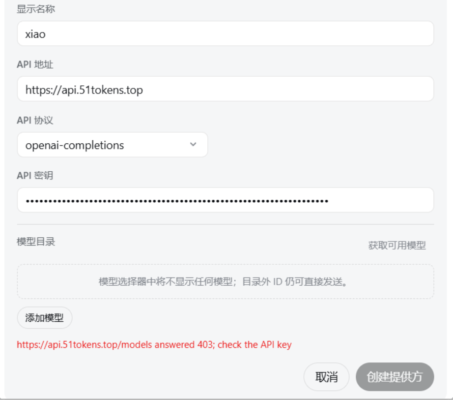
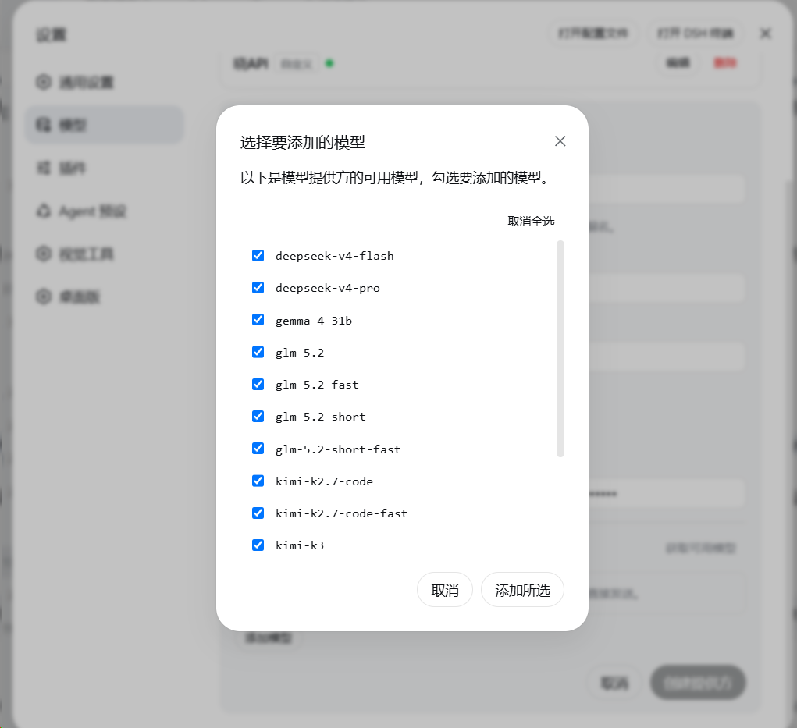

# dsh-proxy

[English](README_EN.md) | 简体中文

**为 DeepSeek Harness 注入自定义 HTTP 代理** —— 让 DSH 宿主进程的全部 fetch 流量（LLM 请求、模型发现、插件市场、web 搜索）走你指定的代理（Clash / mihomo / v2ray 等），**无需开启 TUN 模式**，也不依赖系统代理。

## 为什么需要它

DSH 桌面端 / Web 端的 LLM 请求由宿主 Node 进程发出，走的是 Node 全局 `fetch`（undici）：

- **不读系统代理**：Windows 设置里的代理、Clash 的"系统代理"开关对它无效。
- **不读代理环境变量**：`HTTPS_PROXY` 等环境变量对 Node 全局 fetch 无效。
- **没有内置代理设置**：DSH 的设置界面与提供方配置里都没有代理选项。

于是当某个 API 端点被 Cloudflare 按 IP 拦截（国内宽带段很常见）、或你必须经代理才能访问时，唯一的选择曾是 Clash 的 TUN 模式。本插件提供了另一条路：**在宿主进程内把全局 fetch 的 dispatcher 换成 ProxyAgent**，所有请求经你的代理出站，由 Clash 的规则模式继续负责分流（国内直连、国外走节点），互不冲突。

## 效果对比

| 使用前（被 Cloudflare 按 IP 拦截，403） | 使用后（正常拉出模型列表） |
|---|---|
|  |  |

## 工作原理

插件与 DSH 的 LLM 适配器运行在同一个宿主 Node 进程中。加载时：

1. 保存当前全局 dispatcher；
2. 用 `undici` 的 `ProxyAgent` 构造一个带绕过名单的路由 dispatcher，并通过 `setGlobalDispatcher` 安装；
3. 之后进程内**所有**全局 fetch（模型发现 `GET /models`、OpenAI SDK 聊天请求、插件市场、web 搜索等）都经代理出站；
4. 卸载插件或在设置中关闭开关，即恢复原来的 dispatcher，无需重启。

绕过名单（`noProxy`）默认包含 `localhost`、`127.0.0.1`、`::1`，本地回环请求永远直连。

## 安装

### 方式一：把下面这段提示词直接粘贴到 DSH 对话里（推荐）

复制以下整段文字，发送给你正在使用的 DSH Agent，它会代为完成安装与配置：

```text
请帮我安装并启用 dsh-proxy 插件（DeepSeek Harness 的自定义 HTTP 代理插件）。步骤：
1. 执行：dsh plugin --profile desktop add github:BuLongY/dsh-proxy
   （DSH 桌面端用 desktop profile；纯 Web 部署则把 desktop 换成 web。
    如果提示有挂起的安装恢复事务 "another plugin install recovery transaction is pending"，
    先把 %APPDATA%\DSH Desktop\plugin-install-recovery\state.json 重命名为 state.json.bak 隔离，再重试。
    如果报 ERR_PNPM_GIT_DEP_PREPARE_NOT_ALLOWED，按报错提示把完整的 allowBuilds 键加入
    %UserProfile%\.dsh\profiles\desktop\pnpm-workspace.yaml 后重试。）
2. 安装完成后提醒我重启 DSH Desktop 使插件生效。
3. 重启后插件默认启用代理 127.0.0.1:7890（Clash 混合端口）。
   如果我的代理地址或端口不同，请在 设置 → 插件 → 插件配置 → dsh-proxy 中直接修改，保存即生效，无需重启。
4. 用一个需要代理的 API 提供方（点"获取可用模型"）验证是否成功。
```

### 方式二：命令行手动安装

```powershell
dsh plugin --profile desktop add github:BuLongY/dsh-proxy
```

然后**重启 DSH Desktop**。插件默认启用 `127.0.0.1:7890`（Clash/mihomo 混合端口）。

发布到 npm 后也可直接 `dsh plugin --profile desktop add dsh-proxy`（无需构建放行步骤）。

## 配置

安装后在 **设置 → 插件 → 插件配置 → dsh-proxy** 中直接编辑（保存即时生效，无需重启）：

| 字段 | 默认值 | 说明 |
|---|---|---|
| `enabled` | `true` | 总开关。关闭即恢复直连，无需卸载。 |
| `host` | `127.0.0.1` | 代理服务器地址。 |
| `port` | `7890` | 代理服务器端口（1–65535）。 |
| `noProxy` | `localhost, 127.0.0.1, ::1, [::1]` | 绕过名单：精确匹配主机名；以 `.` 开头匹配域名后缀（如 `.lan`）；`*` 表示全部直连。 |

也可以直接编辑 `%UserProfile%\.dsh\settings.yaml` 中的 `dsh-proxy` 配置节。仅支持 HTTP 代理；SOCKS5 用户请使用 Clash/mihomo 的混合端口。

## 验证

1. 确认 Clash/mihomo 正在运行且混合端口为 7890；
2. 打开一个需要代理才能访问的 API 提供方配置页，点 **获取可用模型**；
3. 能拉出模型列表即成功。失败时查看 `%APPDATA%\DSH Desktop\logs\` 中当天日志里 `dsh-proxy` 的行。

## 平台支持

- **Windows 10/11**：主要开发与测试平台。
- **macOS / Linux**：插件本身是纯 Node 网络层代码，与平台无关；任何运行 DSH 的平台均可使用（欢迎反馈实测结果）。

## 常见问题

**Q: 开了 Clash 系统代理，为什么 DSH 还是直连？**
A: 系统代理只对遵循它的应用有效（浏览器等）。DSH 的 LLM 请求在 Node 宿主进程里用 undici fetch 发出，不读系统代理——这正是本插件存在的原因。

**Q: 和 Clash TUN 模式冲突吗？**
A: 不冲突。两者任选其一即可；同时开也没问题（请求会经代理端口再进 Clash，规则分流依然生效）。

**Q: 会影响插件市场、web 搜索吗？**
A: 会——进程内所有全局 fetch 都走代理。在 Clash 规则模式下这正是期望行为：国内站点依然直连。

**Q: 支持 SOCKS5 吗？**
A: 不支持。undici 的 ProxyAgent 只接受 HTTP/HTTPS 代理。Clash/mihomo 的混合端口同时提供 HTTP 代理能力，填它即可。

## 开发

```powershell
npm install
npm run build      # tsc -> lib/
npm test           # node --test test/
# 带真实代理的 live 测试：
$env:DSH_PROXY_LIVE='1'; npm test
```

## License

[MIT](LICENSE)
